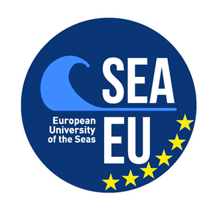

# JokeR

  

[Главная](index) | [Проект](project) | [Публикации](publications) | Партнеры | [Свяжитесь с нами](contact) | [Приложения](tools) |       
 

## Организаторы: 
* **Liana Ermakova (UBO)**
 Профессор ИТ
 HCTI EA-4249, Department of Humanities and Social Sciences
 [Ссылка на профиль](https://www.univ-brest.fr/hcti/menu/Membres/Enseignants-chercheurs/Ermakova--Liana)
 *Лидер Проекта*

* **Benoît Jeanjean (UBO)**
 Профессор Латыни
 HCTI EA-4249, Department of Humanities and Social Sciences
 [Ссылка на профиль](https://www.univ-brest.fr/hcti/menu/Membres/Enseignants-chercheurs/Jeanjean__Benoit)
 *Участник*

* **Gaëlle Le Corre (UBO)** 
 Профессор Английской Лингвистики
 EA 4451 CRBC, UFR ALL SHS, Department of English
 [Ссылка на профиль](https://www.univ-brest.fr/crbc/menu/Membres+du+laboratoire/Enseignants-chercheurs/Ga-lle-Le-Corre)
 *Участник*

* **Élise Mathurin (UBO)**
 Профессор Английской Лингвистики, курирует первокурсников магистратуры «Техническое письмо/Технический перевод».
 HCTI EA-4249, UFR ALL SHS, Department of English
 [Ссылка на профиль](https://www.univ-brest.fr/hcti/menu/Membres/Enseignants-chercheurs/Mathurin--Elise)
 *Участник*

* **Mohamed Saki (UBO)**
 Профессор Английской Лингвистики
 HCTI EA-4249, Department of Humanities and Social Sciences
 [Ссылка на профиль](https://www.univ-brest.fr/hcti/menu/Membres/Enseignants-chercheurs/Saki--Mohamed)
 *Участник*

* **Radia Hannachi (UBS)** 
 Профессор Французского Языкознания и Французского Языка как Иностранного
 HCTI EA-4249, Faculty of Arts, Humanities and Social Sciences, "Département Ingénierie du Document"
 *Участник*

* **Anne-Gwenn Bosser (ENIB)**
 Доцент в области Вычислительных Наук
 Lab-STICC (CNRS UMR 6285), Leader of the COMMEDIA Team
 [Ссылка на профиль](https://labsticc.fr/en/directory/bosser-anne-gwenn)
 *Участник*

* **Sílvia Araújo (University of Minho, Portugal)**
 Доцент в Области Корпусной Лингвистики, Технологий, Применяемых в Языках и Цифровых Гуманитарных науках
 Department of Humanities and Social Sciences
 [Ссылка на профиль](http://cehum.ilch.uminho.pt/researchers/25)
 *Участник*

* **Fabio Regattin (Università degli Studi di Udine, Italy)** 
 Доцент Перевода с Французского на Итальянский
 Department of Language and Literature, Communication, Education and Society
 [Ссылка на профиль](https://people.uniud.it/page/fabio.regattin)
 *Участник*

* **Tristan Miller (Austrian Research Institute for Artificial Intelligence, Austria)**
 Группа Языковых и Интерактивных Технологий в OFAI
 [Ссылка на профиль](https://logological.org/) 
 *Участник*

## Партнеры из университетов ЮВА-ЕС: 

* **Ġorġ Mallia (University of Malta)**
 Доцент
 Media & Communications department, Faculty of Media & Knowledge Sciences
 [Ссылка на профиль](https://www.um.edu.mt/profile/gorgmallia)
 *Координатор партнерского университета, специалист по юмору*

* **Claudine Borg (University of Malta)**
 Доцент
 Translation, Terminology and Interpreting Studies Faculty of Arts
 [Ссылка на профиль](https://www.um.edu.mt/profile/claudineborg)
 *Участник, специалист по переводу*

* **Monika Bokiniec (University of Gdansk)** 
 Доцент
 Department of Aesthetics and Philosophy of Culture, Faculty of Social Sciences
 [Ссылка на профиль](https://ug.edu.pl/pracownik/413/monika_bokiniec)
 *Координатор партнерского университета*

* **Gordan Matas (University of Split)**
 Доцент
 Department of Language and English Literature
 [Ссылка на профиль](https://www.ffst.unist.hr/gordan.matas)
 *Координатор партнерского университета*

* **Danica Škara (University of Split)**
 Почетный профессор
 English department, Faculty of Philosophy
 [Ссылка на профиль](https://www.researchgate.net/profile/Danica-Skara)
 *Участник*

## Техническое обслуживание сайта:
* **Adrien Couaillet (UBO)**
 Технический перевод/редактирование Магистр
 Department of English
 *Стажер*

* **Ludivine Grégoire (UBO)**
 Технический перевод/редактирование Магистр
 Department of English
 *Стажер*

    
   
     
     

<em>Этот проект получил государственный грант, управляемый Национальным исследовательским агентством в рамках программы «Investissements d'avenir», ссылка ANR-19-GURE-0001</em>

<em>JokeR поддерживается Институтом гуманитарных наук в Бретани (MSHB)</em>

  
  
  

 

   

